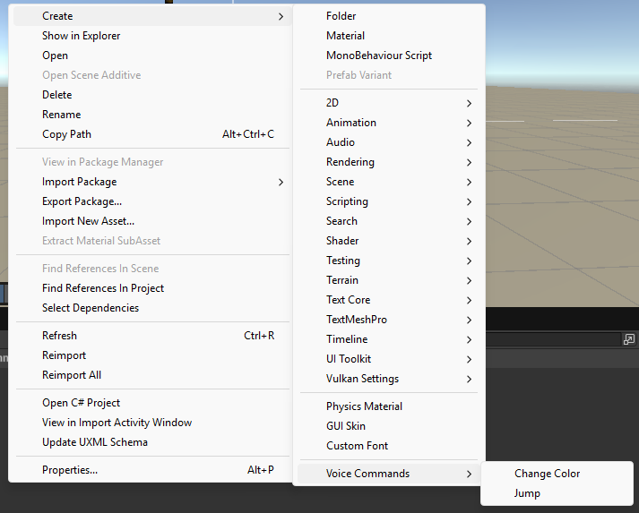
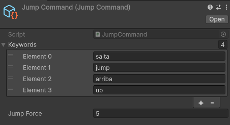
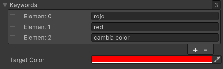
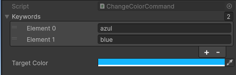
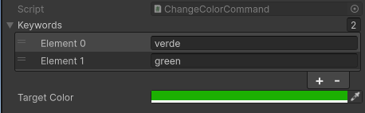

# Práctica 10 II - Reconocimiento del habla

- **Author**: Himar Edhey Hernández Alonso
- **Subject**: Interfaces Inteligentes

## Introduction

In this exercise you will learn how to use the Whisper ASR (Automatic Speech Recognition) model to transcribe audio input from the microphone in real-time. You will create a Unity application that captures audio from the microphone, processes it using the Whisper model, and displays the transcribed text on the screen.

## Objectives

1. *Generar una apk con el proyecto de whisper.tiny para Unity*
For this objective, I have imported the whisper.tiny project from `https://github.com/Macoron/whisper.unity.git` into Unity and using the Sample Scene "2 - Microphone" as a base, I modified the script `MicrophoneDemo.cs` to add a check method that changes the color of a cube to red when the transcribed text contains the word "red". After implementing this functionality, I have generated an APK file that can be installed on Android devices.

```csharp
        private async void OnRecordStop(AudioChunk recordedAudio) {
            buttonText.text = "Record";
            _buffer = "";

            var sw = new Stopwatch();
            sw.Start();

            var res = await whisper.GetTextAsync(recordedAudio.Data,
                            recordedAudio.Frequency, recordedAudio.Channels);
            if (res == null || !outputText)
                return;

            var time = sw.ElapsedMilliseconds;
            var rate = recordedAudio.Length / (time * 0.001f);
            timeText.text = $"Time: {time} ms\nRate: {rate:F1}x";

            var text = res.Result;
            if (printLanguage)
                text += $"\n\nLanguage: {res.Language}";

            ChangeColorIfRed(text);

            outputText.text = text;
            UiUtils.ScrollDown(scroll);
        }

        private void ChangeColorIfRed(string str) {
            if (string.IsNullOrEmpty(str) || cube == null)
            return;
            var s = str.ToLowerInvariant();
            if (s.Contains("red") || s.Contains("rojo")) {
            var rend = cube.GetComponent<Renderer>();
            if (rend != null)
                rend.material.color = Color.red;
            }
        }
```

With this aproximation we could use a dictionary for using multiple commands and change different properties of the cube or other objects in the scene.

```csharp
        private void InitializeVoiceCommands() {
            _voiceCommands = new Dictionary<string[], Action> {
                { new[] { "red", "rojo" }, () => ChangeCubeColor(Color.red) },
                { new[] { "blue", "azul" }, () => ChangeCubeColor(Color.blue) },
                { new[] { "green", "verde" }, () => ChangeCubeColor(Color.green) },
                { new[] { "jump", "saltar", "salta" }, () => MakeCubeJump() },
                { new[] { "hide", "esconder", "ocultar" }, () => HideCube() },
                { new[] { "show", "mostrar", "aparecer" }, () => ShowCube() }
            };
        }
        
        ...

        private void ProcessVoiceCommands(string text) {
            if (string.IsNullOrEmpty(text))
                return;

            var lowerText = text.ToLowerInvariant();

            foreach (var command in _voiceCommands) {
                foreach (var keyword in command.Key) {
                    if (lowerText.Contains(keyword)) {
                        command.Value?.Invoke();
                        return; // Solo ejecutar el primer comando encontrado
                    }
                }
            }
        }
        
        ...


        private async void OnRecordStop(AudioChunk recordedAudio) {
            buttonText.text = "Record";
            _buffer = "";

            var sw = new Stopwatch();
            sw.Start();

            var res = await whisper.GetTextAsync(recordedAudio.Data,
                            recordedAudio.Frequency, recordedAudio.Channels);
            if (res == null || !outputText)
                return;

            var time = sw.ElapsedMilliseconds;
            var rate = recordedAudio.Length / (time * 0.001f);
            timeText.text = $"Time: {time} ms\nRate: {rate:F1}x";

            var text = res.Result;
            if (printLanguage)
                text += $"\n\nLanguage: {res.Language}";

            ProcessVoiceCommands(text);

            outputText.text = text;
            UiUtils.ScrollDown(scroll);
        }

```

This way, we can easily expand the functionality by adding more commands to the dictionary without cluttering the main processing logic.

[MicrophoneDemo.cs](MicrophoneDemo.cs)


2. *En la escena que con guerreros y escudos crea una mecánica que al seleccionar un guerrero le des al menos dos instrucciones por voz diferentes y las ejecute. La grabación se activará al pulsar una tecla.*

For this objective, We could use the command pattern to implement the voice commands for the warriors. Each command will be encapsulated in its own class, allowing for easy extension and maintenance. We can do this using ScriptableObjects in Unity to define the commands.

[Voice Command](CommandPattern/VoiceCommand.cs)

So we can create specific command classes like `ChangeColorCommand` and `JumpCommand` that implement the `VoiceCommand` interface.

[ChangeColorCommand.cs](CommandPattern/ChangeColorCommand.cs)
[JumpCommand.cs](CommandPattern/JumpCommand.cs)

This way, we only need to create new command classes for additional voice commands, keeping the code organized and adhering to the Open/Closed Principle. The `Warrior` class can then execute these commands based on the recognized voice input.

In the [MicrophoneWithCommands](MicrophoneWithCommands.cs) script, we use `ProcessVoiceCommands` method to execute the appropriate command based on the transcribed text.

In the Unity Project, I have created the necessary ScriptableObjects for the commands and assigned the properties in the inspector for each one. So I can easly assign each command to the `MicrophoneWithCommands` array of commands.







I also have to add a Plane to the scene and a box collider and a rigidbody to the warrior prefab to make the jump command work properly.

[Microphone With Commands Excecution](Resources/microphone_with_commands_execution.mp4)
